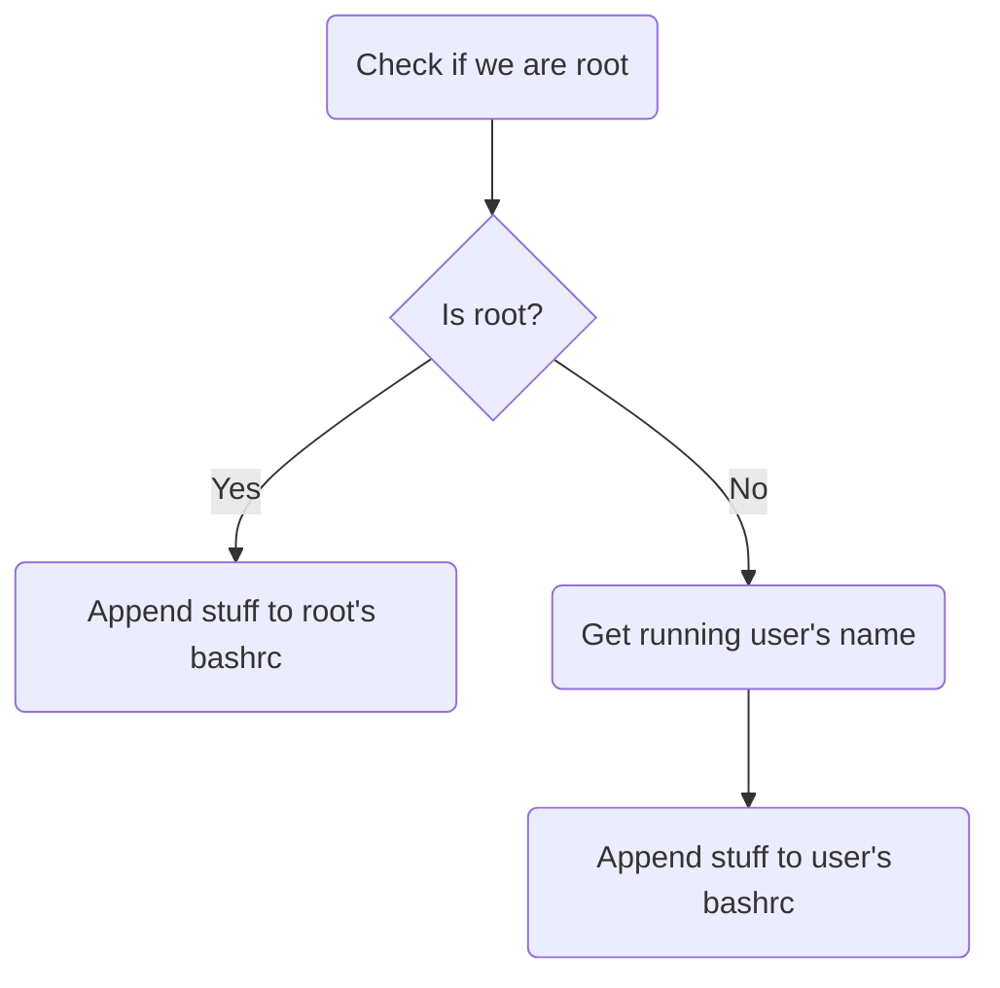

# Wine Escape
Write anything to .bashrc (or any file really) from an exe ran with wine

## QnA
### Why?
Idk i just felt like it

### How?
> [!NOTE]  
> This assumes that the `Z:` drive in wine points to `/`. If it doesn't, this will not work.

Wine's drives are mapped to standard linux folders, and in particular `Z:/` is mapped by default to `/` to allow the user to access its entire system (for e.g. saving files from programs run via wine). \
So this means you can write to any file you have the permission to - anything in `Z:/home/USERNAME` if wine is ran normally, or anywhere if wine is ran using `sudo` (which you should never do)

### What?
This code is a basic example, and at such it only does the following:

In this example, what is appended to the bashrc (in both cases) is simply `echo "meow meow :3" >> meowing.txt`, so a line will be added to `meowing.txt` in the current directory each time `bash` is ran.\
Other ideas i had:
- run the [Vencord](https://github.com/Vendicated/Vencord) installer if you have root access
- create a file named something like `bashrc.sh` and put it in `~/.config/bash/` then source it from either `.bashrc` or `.profile`
- download executables and put them in `~/.local/bin/`

### Isnt this dangerous?
1. being on linux doesnt mean no caution. don't run random exe files lol
2. don't run wine with sudo you idiot. literally useless
3. anyone with more than 3 braincells could write this
 
### Why use the windows API (windows.h) instead of a cross platform api (stdio.h)
well the point is to build an exe lol (also i was curious how to use windows api functions and i hate it now)

### Why not do literally anything else since you are root?
Hey this is an example, if you want to do more than that just do it yourself    also meow

## Compiling
`x86_64-w64-mingw32-g++ main.cpp -o meow.exe`